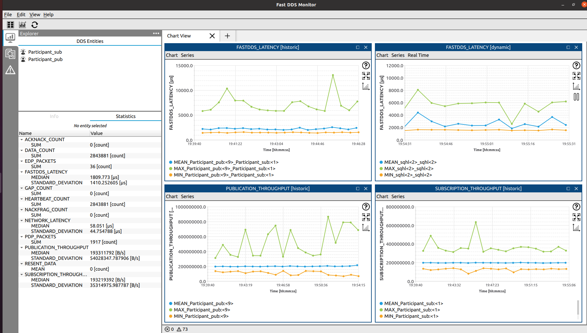
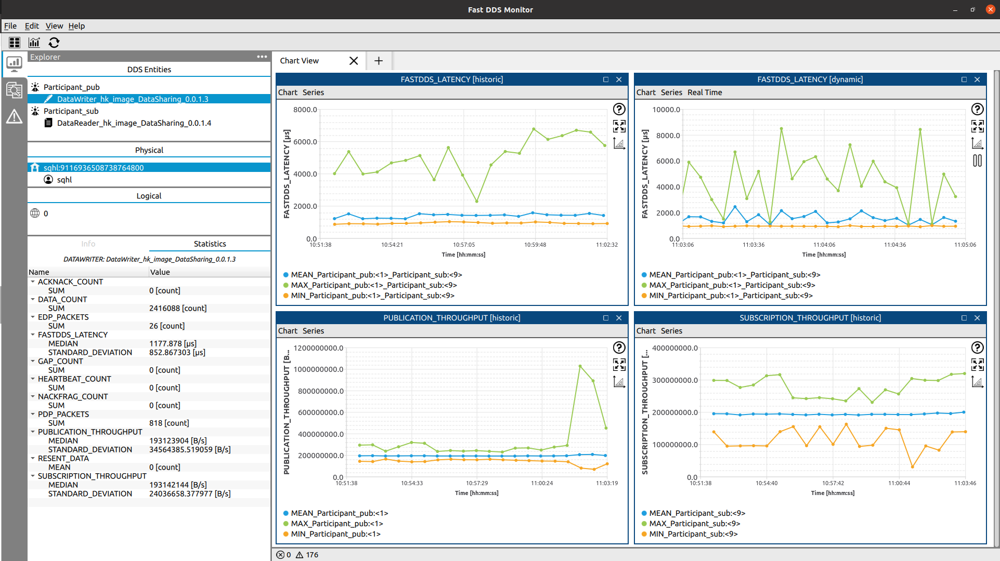
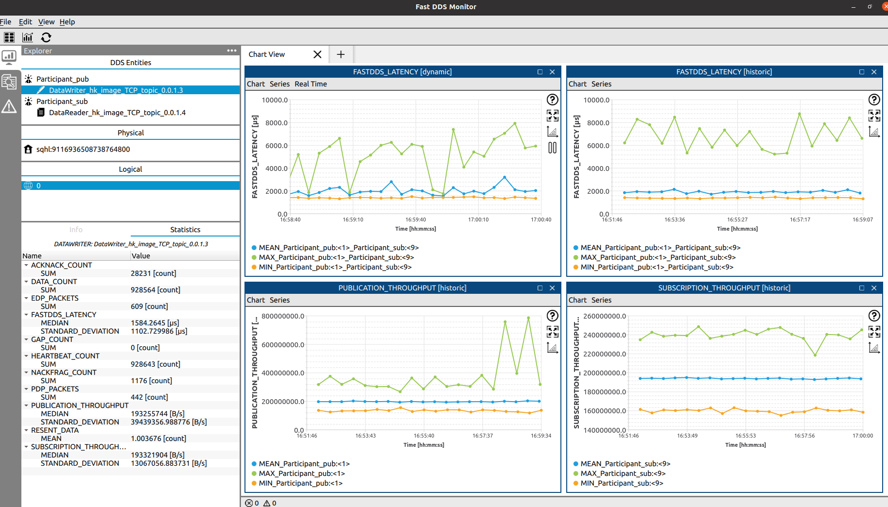
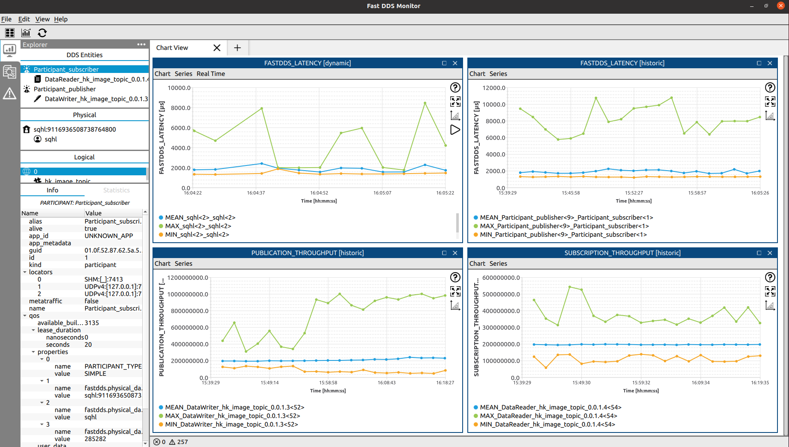
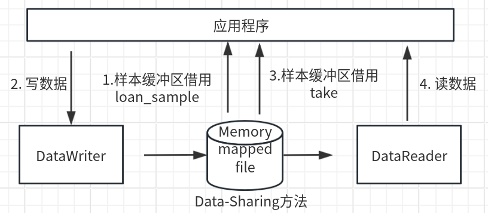
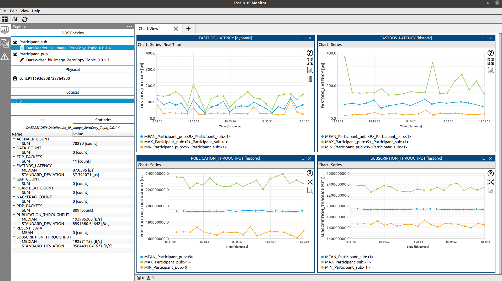

# fastdds传输海康图像数据（不依赖ROS2）

Fast DDS 支持多种数据传输方式，包括共享内存、Data-sharing、TCP/UDP、Zero Copy 等方法。在发布者应用程序中，通过SDK从相机设备获取图像数据，并通过 `DataWriter` 发布。在订阅者应用程序中，使用 `DataReader` 接收图像数据，并进行后续处理。

实现步骤：定义图像IDL数据结构、生成序列化和反序列化接口、编写数据发布和订阅程序、监控数据传输的性能指标。


## 方案一：共享内存传输

参考：https://fast-dds.docs.eprosima.com/en/v2.14.3/fastdds/transport/shared_memory/shared_memory.html  

```
#通过fastdds_monitor监控数据传输的性能指标，参考：https://github.com/eProsima/Fast-DDS-monitor

cd ~/path/to/build
export FASTDDS_STATISTICS="HISTORY_LATENCY_TOPIC;NETWORK_LATENCY_TOPIC;\
PUBLICATION_THROUGHPUT_TOPIC;SUBSCRIPTION_THROUGHPUT_TOPIC;RTPS_SENT_TOPIC;\
RTPS_LOST_TOPIC;HEARTBEAT_COUNT_TOPIC;ACKNACK_COUNT_TOPIC;NACKFRAG_COUNT_TOPIC;\
GAP_COUNT_TOPIC;DATA_COUNT_TOPIC;RESENT_DATAS_TOPIC;SAMPLE_DATAS_TOPIC;\
PDP_PACKETS_TOPIC;EDP_PACKETS_TOPIC;DISCOVERY_TOPIC;PHYSICAL_DATA_TOPIC;\
MONITOR_SERVICE_TOPIC"
./my_hk_FastDDS_Publisher
 
#另一个终端窗口
cd ~/path/to/build
export FASTDDS_STATISTICS="HISTORY_LATENCY_TOPIC;NETWORK_LATENCY_TOPIC;\
PUBLICATION_THROUGHPUT_TOPIC;SUBSCRIPTION_THROUGHPUT_TOPIC;RTPS_SENT_TOPIC;\
RTPS_LOST_TOPIC;HEARTBEAT_COUNT_TOPIC;ACKNACK_COUNT_TOPIC;NACKFRAG_COUNT_TOPIC;\
GAP_COUNT_TOPIC;DATA_COUNT_TOPIC;RESENT_DATAS_TOPIC;SAMPLE_DATAS_TOPIC;\
PDP_PACKETS_TOPIC;EDP_PACKETS_TOPIC;DISCOVERY_TOPIC;PHYSICAL_DATA_TOPIC;\
MONITOR_SERVICE_TOPIC"
./my_hk_FastDDS_Subscriber

##另一个终端窗口，打开fastdds_monitor监控程序，测量通信参数（延迟、吞吐量、丢包等），并实时记录和计算这些参数的统计测量结果（均值、方差、标准差等）。 
cd /usr/local/bin && ./fastdds_monitor
```



左上角图：发布者和订阅者之间的延迟时间（显示最近一分钟，单位：us）

右上角图：发布者和订阅者之间的延迟时间（显示历史数据，单位：us）

左下角图：发布者的吞吐量（单位：B/S）

右下角图：订阅者的吞吐量（单位：B/S）


## 方案二：Data-sharing传输

参考：https://fast-dds.docs.eprosima.com/en/latest/fastdds/transport/datasharing.html#data-sharing-delivery-configuration  



左上角图：发布者和订阅者之间的延迟时间（显示最近一分钟，单位：us）

右上角图：发布者和订阅者之间的延迟时间（显示历史数据，单位：us）

左下角图：发布者的吞吐量（单位：B/S）

右下角图：订阅者的吞吐量（单位：B/S）


## 方案三：TCP传输



左上角图：发布者和订阅者之间的延迟时间（显示最近一分钟，单位：us）

右上角图：发布者和订阅者之间的延迟时间（显示历史数据，单位：us）

左下角图：发布者的吞吐量（单位：B/S）

右下角图：订阅者的吞吐量（单位：B/S）


## 方案四：UDP传输

参考：https://fast-dds.docs.eprosima.com/en/latest/fastdds/getting_started/simple_app/simple_app.html



左上角图：发布者和订阅者之间的延迟时间（显示最近一分钟，单位：us）

右上角图：发布者和订阅者之间的延迟时间（显示历史数据，单位：us）

左下角图：发布者的吞吐量（单位：B/S）

右下角图：订阅者的吞吐量（单位：B/S）


## 方案五：Zero Copy传输

参考：https://fast-dds.docs.eprosima.com/en/latest/fastdds/use_cases/zero_copy/zero_copy.html#use-case-zero-copy

零拷贝技术目的：降低冗余数据拷贝、内核态&用户态的切换次数，解放CPU拷贝过程。零拷贝的“零”指的是：不需要将数据从内核态拷贝到用户态了。

零拷贝通信允许在应用程序之间传输数据，而无需在内存中复制数据，从而节省时间和资源。为了实现这一点，它在 DataWriter 和 DataReader 之间使用Data-Sharing delivery数据共享交付，并在应用程序和 Fast DDS 之间使用数据缓冲区借用(data buffer loans)。如下图所示：



（1）应用程序在 DataWriter  中借用样本的缓冲区，然后直接在此缓冲区上写入样本数据，这样可以避免在发布应用程序和 DataWriter  之间复制数据。（2）应用程序从 DataReader 借出来订阅者端的数据，获取接收到的样本作为引用，这样可以避免将数据从 DataReader 复制到应用程序。本质上就是引用。



左上角图：发布者和订阅者之间的延迟时间（显示最近一分钟，单位：us）

右上角图：发布者和订阅者之间的延迟时间（显示历史数据，单位：us）

左下角图：发布者的吞吐量（单位：B/S）

右下角图：订阅者的吞吐量（单位：B/S）


## 总结

传输数据：图像帧率50HZ，单张图像数据量 = 1280 * 1024 * 3

指标定义：在 DDS 通信交换的情况下，“延迟时间”为 DataWriter 序列化和发送数据消息所需的时间加上匹配的 DataReader 接收和反序列化它所需的时间。 

结论：在50HZ、吞吐量193MB/S的情况下，Zero Copy零拷贝方案的延迟时间仅为87us。

|                  | 延迟时间（us） | 吞吐量（B/S） |
| ---------------- | -------------- | ------------- |
| **共享内存**     | 1809.773       | 193311792     |
| **Data-sharing** | 1177.878       | 193123904     |
| **TCP**          | 1584.2654      | 193255744     |
| **UDP**          | 1027.426       | 193245861     |
| **Zero Copy**    | 87.0395        | 192995200     |


